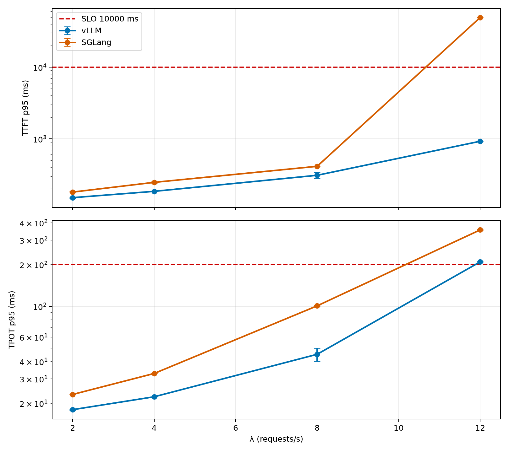
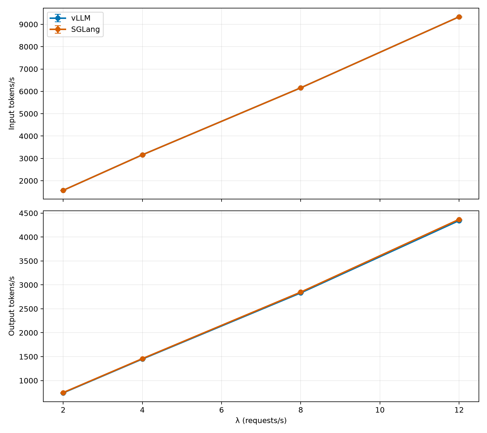
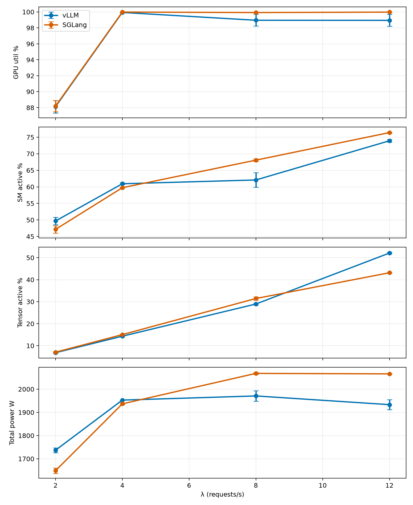

# Apertus-70B vLLM vs SGLang: pure-cache-disabled comparison

**Date:** 2026-06-18  
**Model:** `swiss-ai/Apertus-70B-Instruct-2509`  
**Hardware:** single Clariden GH200 node per engine, TP4  
**Replicates:** N=2 per engine  
**Benchmark nodes:** `infra02` with `power_throttling` reservation

## Executive Summary

This report compares vLLM and SGLang on Apertus-70B after correcting the initial invalid comparison. vLLM prefix caching and SGLang radix caching are both disabled. The exact same prompt pool, arrival process, phases, SLOs, and served models were reused across the two replicates.

| Finding | Result |
|---|---|
| Maximum passing swept rate | Both engines pass through **λ=8 req/s** |
| Saturation point | Both engines early-stop at **λ=12 req/s** |
| vLLM saturation reason | TPOT p95 crosses 200 ms at λ=12 |
| SGLang saturation reason | TTFT p95 jumps to ~49 s and TPOT p95 ~355 ms at λ=12 |
| Replicability | The λ=12 failure mode reproduced in both runs |

## Methodology

| Attribute | Value |
|---|---|
| Scenario | `thesis-apertus-medium` |
| Prompt source | `/capstor/scratch/cscs/bsezen/loadtest/prompts-apertus.json`, label `medium` only |
| Source input-token shape | 1,000 medium prompts; min 403, p25 542, median 591, p75 635, p95 683, max 700, mean 585.6 ± 65.3 |
| Source output budget shape (`max_tokens`) | min 2, p25 157, median 263, p75 382, p95 533, max 799, mean 275.1 ± 154.3 |
| Observed successful output length | ~269-278 output chunks/tokens/request depending on λ and engine |
| Total prompts | 20,000 generated from 1,000 medium prompts with recycling |
| Arrival process | Poisson |
| Sweep | `[2, 4, 8, 12, 16, 20, 24]` req/s with early stop |
| Phases | 60 s warmup, 180 s measurement, 300 s drain |
| SLOs | TTFT p95 ≤ 10,000 ms, TPOT p95 ≤ 200 ms, error ≤ 1% |

The exact same offered load was used for both engines and both replicates. The corpus is intentionally synthetic: each prompt is filler text (`" a"`, `" the"`, `" x"`, `" A"`, `"hello"`, or `" token"`) chosen so the Apertus tokenizer produces exact target token counts. The benchmark uses only the `medium` label, not the long-input or XL-input prompts. This makes the workload suitable for controlled throughput/latency stress, but not for quality conclusions.

### Serving Launch Configuration

| Engine | Served model | SLURM job | Node | Relevant launch flags | Launch script |
|---|---|---:|---|---|---|
| vLLM | `swiss-ai/Apertus-70B-Instruct-2509-vllm-pure-brachium-20260618-115341` | 2558545 | nid006189 | `--no-enable-prefix-caching` | `sml/model-launch/local/apertus70b-vllm-vs-sglang/01_vllm_pure.sh` |
| SGLang | `swiss-ai/Apertus-70B-Instruct-2509-sglang-pure-brachium-20260618-115342` | 2558544 | nid006134 | `--disable-radix-cache`, `--enable-metrics` | `sml/model-launch/local/apertus70b-vllm-vs-sglang/02_sglang_pure.sh` |

The corrected comparison intentionally disables both caching paths that would otherwise make the engine comparison asymmetric: vLLM prefix caching is disabled and SGLang radix caching is disabled. SGLang metrics are enabled so Prometheus/DCGM-related scraping remains available.

The benchmark databases also contain IBT `backend_config` metadata, but these runs used external SML-served SwissAI API endpoints. For serving behavior, the launch scripts and served-model job configuration above are authoritative.

### Prompt and Output Distribution

| Field | min | p25 | median | p75 | p95 | max | mean ± std |
|---|---:|---:|---:|---:|---:|---:|---:|
| Source `input_tokens` | 403 | 542 | 591 | 635 | 683 | 700 | 585.6 ± 65.3 |
| Source `max_tokens` | 2 | 157 | 263 | 382 | 533 | 799 | 275.1 ± 154.3 |

Observed successful response lengths closely track the source output budgets because `output_length_mode: forced` was used. Across the corrected runs, average observed output length is ~269-278 output chunks/tokens per request.

## Capacity

### TTFT p95 (ms, mean ± std)

| Engine | λ=2 | λ=4 | λ=8 | λ=12 |
|---|---:|---:|---:|---:|
| vLLM | 151.2 ± 3.2 | 185.3 ± 0.7 | 310.5 ± 29.6 | 926.4 ± 4.4 |
| SGLang | 180.9 ± 2.9 | 247.4 ± 4.3 | 414.2 ± 0.9 | 49459.6 ± 30.8 |

### TPOT p95 (ms, mean ± std)

| Engine | λ=2 | λ=4 | λ=8 | λ=12 |
|---|---:|---:|---:|---:|
| vLLM | 18.0 ± 0.1 | 22.3 ± 0.0 | 45.1 ± 4.9 | 209.1 ± 2.7 |
| SGLang | 23.2 ± 0.0 | 32.8 ± 0.0 | 100.8 ± 0.5 | 355.4 ± 3.3 |

At λ=8, vLLM has lower TTFT and substantially lower TPOT. At λ=12 both engines breach the TPOT SLO, but SGLang also develops a large TTFT queueing spike while vLLM remains below the TTFT SLO.

## Token Throughput

### Output tokens/s (mean ± std)

| Engine | λ=2 | λ=4 | λ=8 | λ=12 |
|---|---:|---:|---:|---:|
| vLLM | 741.7 ± 0.2 | 1449.4 ± 0.2 | 2831.9 ± 0.1 | 4344.1 ± 1.9 |
| SGLang | 748.2 ± 0.1 | 1458.0 ± 0.1 | 2848.9 ± 0.2 | 4369.7 ± 0.1 |

The throughput curves use successful request rows only. Error rate was 0% in all corrected and replicated rate levels.

## DCGM Telemetry

### GPU utilization % (mean ± std)

| Engine | λ=2 | λ=4 | λ=8 | λ=12 |
|---|---:|---:|---:|---:|
| vLLM | 88.1 ± 0.8 | 99.9 ± 0.1 | 99.0 ± 0.7 | 98.9 ± 0.8 |
| SGLang | 88.2 ± 0.7 | 100.0 ± 0.0 | 99.9 ± 0.0 | 100.0 ± 0.0 |

### SM active % (mean ± std)

| Engine | λ=2 | λ=4 | λ=8 | λ=12 |
|---|---:|---:|---:|---:|
| vLLM | 49.7 ± 1.1 | 60.9 ± 0.3 | 62.1 ± 2.2 | 73.9 ± 0.4 |
| SGLang | 47.1 ± 1.1 | 59.7 ± 0.1 | 68.1 ± 0.4 | 76.4 ± 0.2 |

### Total GPU power W, 4 GPUs (mean ± std)

| Engine | λ=2 | λ=4 | λ=8 | λ=12 |
|---|---:|---:|---:|---:|
| vLLM | 1737.0 ± 10.4 | 1952.8 ± 0.0 | 1970.7 ± 22.4 | 1933.2 ± 21.0 |
| SGLang | 1648.7 ± 11.3 | 1936.6 ± 3.6 | 2067.9 ± 4.4 | 2065.8 ± 1.4 |

DCGM was queried from SwissAI Prometheus/Grafana for the served-model SLURM jobs:

| Engine | SLURM job | Node |
|---|---:|---|
| vLLM | 2558545 | nid006189 |
| SGLang | 2558544 | nid006134 |

The report stores per-rate DCGM values in `data.json`, including GPU utilization, SM-active, tensor-active, memory-copy utilization, framebuffer used, and total GPU power. These counters are aligned to each benchmark level using the `server_stats` timestamps from the run DBs.

## Interpretation

The replicated result supports the corrected conclusion: vLLM is materially faster on this workload when both prefix/radix caching paths are disabled. The largest operational difference is at λ=12: vLLM is near the TPOT SLO boundary, while SGLang queues hard enough to push TTFT p95 to ~49 seconds.

This is a capacity result, not a quality result. Quality evaluation was disabled. The prompts are synthetic token-count prompts, so the run answers scheduler/throughput behavior under controlled token shapes.

## Disclosures & Limitations

- Initial invalid run was discarded because vLLM prefix caching was not disabled while SGLang radix cache was disabled.
- The IBT recycling path bug was fixed before the corrected runs; otherwise high-rate vLLM could crash when the pool recycled.
- SwissAI streaming does not reliably emit `[DONE]`; the benchmark accepts truncated streams with content via `IBT_ACCEPT_TRUNCATED_STREAM_WITH_CONTENT=1`.
- DCGM counters are external telemetry, aligned by wall-clock windows, not rows persisted inside the IBT DB.
- No quality gate or quality comparison was run.

## Provenance

| Item | Value |
|---|---|
| vLLM served model | `swiss-ai/Apertus-70B-Instruct-2509-vllm-pure-brachium-20260618-115341` |
| SGLang served model | `swiss-ai/Apertus-70B-Instruct-2509-sglang-pure-brachium-20260618-115342` |
| vLLM run DBs | `data/vllm_run1.db`, `data/vllm_run2.db` |
| SGLang run DBs | `data/sglang_run1.db`, `data/sglang_run2.db` |
| Generated | 2026-06-18T10:32:24.865817+00:00 |
