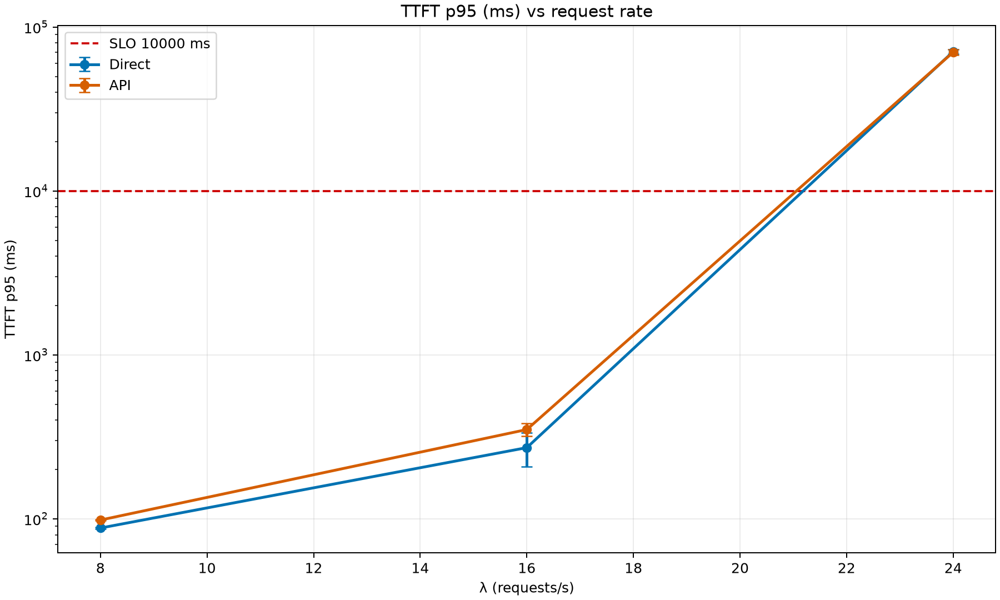
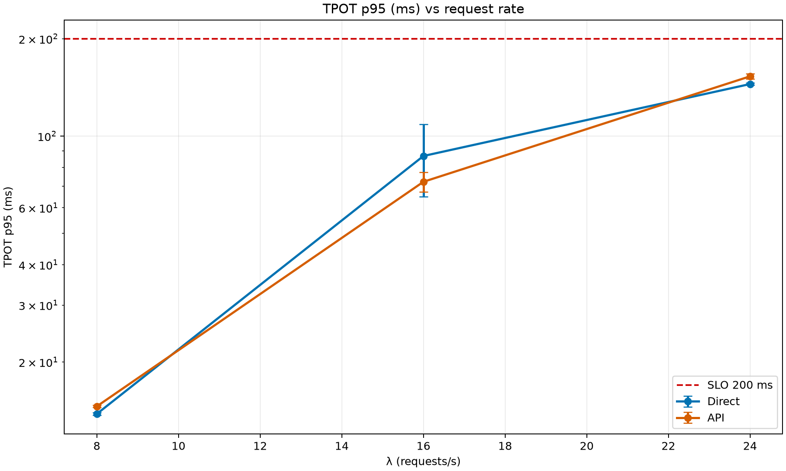

# Apertus-8B SwissAI API Overhead

**Date:** 2026-06-18  
**Model:** `swiss-ai/Apertus-8B-Instruct-2509`  
**Engine:** SGLang, radix cache disabled, metrics enabled  
**Serving:** SGLang, same launch configuration  
**Replicates:** N=3 per endpoint path

## Research Question

Does routing requests through `https://api.swissai.svc.cscs.ch` add measurable latency or throughput overhead compared with hitting the same Apertus-8B SGLang server directly from the benchmarker allocation?

## Methodology

| Attribute | Value |
|---|---|
| Direct endpoint | `http://172.28.40.248:8080` |
| API endpoint | `https://api.swissai.svc.cscs.ch` |
| Served model name | `swiss-ai/Apertus-8B-Instruct-2509-api-overhead-sglang-brachium-20260618-183436` |
| Launch script | `launch-scripts/01_sglang_apertus8b_api_overhead.sh` |
| Prompt scenario | `thesis-apertus-medium` |
| Arrival process | Poisson |
| Sweep | `[8, 16, 24, 32, 40, 48, 56, 64]` with early stop |
| Phases | 60 s warmup, 180 s measurement, 300 s drain |
| SLOs used | TTFT p95 ≤ 10,000 ms, TPOT p95 ≤ 200 ms, error ≤ 1% |

Only the endpoint path changed between paired runs. The same served model, prompt shape, benchmark node class, and rate schedule were used for direct and API runs.

## Results

### TTFT p95 (ms, mean ± std)

| Path | λ=8 | λ=16 | λ=24 |
|---|---:|---:|---:|
| Direct | 87.9 ± 0.9 | 271.9 ± 63.3 | 70863.4 ± 2391.2 |
| API | 98.3 ± 0.5 | 350.6 ± 31.1 | 70277.7 ± 2884.5 |

### TPOT p95 (ms, mean ± std)

| Path | λ=8 | λ=16 | λ=24 |
|---|---:|---:|---:|
| Direct | 13.8 ± 0.1 | 86.7 ± 21.9 | 144.8 ± 1.2 |
| API | 14.6 ± 0.1 | 72.2 ± 5.0 | 152.9 ± 2.8 |

### Output tokens/s (mean ± std)

| Path | λ=8 | λ=16 | λ=24 |
|---|---:|---:|---:|
| Direct | 2834.8 ± 3.2 | 5878.8 ± 4.5 | 8610.6 ± 4.0 |
| API | 2774.0 ± 2.0 | 5748.2 ± 6.2 | 8430.5 ± 7.1 |

### Error rate % (mean ± std)

| Path | λ=8 | λ=16 | λ=24 |
|---|---:|---:|---:|
| Direct | 0.0 ± 0.0 | 0.0 ± 0.0 | 0.0 ± 0.0 |
| API | 0.0 ± 0.0 | 0.0 ± 0.0 | 0.0 ± 0.0 |

Both paths passed through λ=16 and early-stopped at λ=24 due TTFT p95 saturation. The API path shows a small low-load TTFT increase, while TPOT and the saturation point are similar in these two replicates.

## DCGM Telemetry

### GPU utilization % (mean ± std)

| Path | λ=8 | λ=16 | λ=24 |
|---|---:|---:|---:|
| Direct | 25.0 ± 0.0 | 24.1 ± 1.2 | 24.6 ± 0.4 |
| API | 25.0 ± 0.0 | 25.0 ± 0.0 | 25.0 ± 0.0 |

### SM active % (mean ± std)

| Path | λ=8 | λ=16 | λ=24 |
|---|---:|---:|---:|
| Direct | 16.2 ± 0.6 | 21.3 ± 0.7 | 22.8 ± 0.1 |
| API | 16.4 ± 0.3 | 21.7 ± 0.0 | 23.0 ± 0.1 |

### Total GPU power W (mean ± std)

| Path | λ=8 | λ=16 | λ=24 |
|---|---:|---:|---:|
| Direct | 767.6 ± 0.9 | 784.2 ± 6.6 | 790.6 ± 9.7 |
| API | 772.7 ± 7.3 | 786.8 ± 8.8 | 791.9 ± 6.5 |

DCGM telemetry is queried by served-model SLURM job ID and aligned to each benchmark measurement window using timestamps from the run DBs.

## Provenance

| Path | Replicate | Benchmark job | DB |
|---|---:|---:|---|
| Direct | 1 | 2561761 | `data/direct_run1.db` |
| Direct | 2 | 2562891 | `data/direct_run2.db` |
| Direct | 3 | 2564347 | `data/direct_run3.db` |
| API | 1 | 2561998 | `data/api_run1.db` |
| API | 2 | 2563417 | `data/api_run2.db` |
| API | 3 | 2564475 | `data/api_run3.db` |

## Limitations

- This is a serving-path overhead experiment, not a model quality evaluation.
- The workload uses the existing synthetic `thesis-apertus-medium` prompt shape.
- λ=24 is saturated in both paths, so API overhead should be interpreted mainly at λ=8 and λ=16.
- Client event-loop lag warnings appeared at λ=24, which reinforces treating the saturated point as overload evidence rather than a precise latency estimate.

Generated: 2026-06-25T10:43:07.104284+00:00
