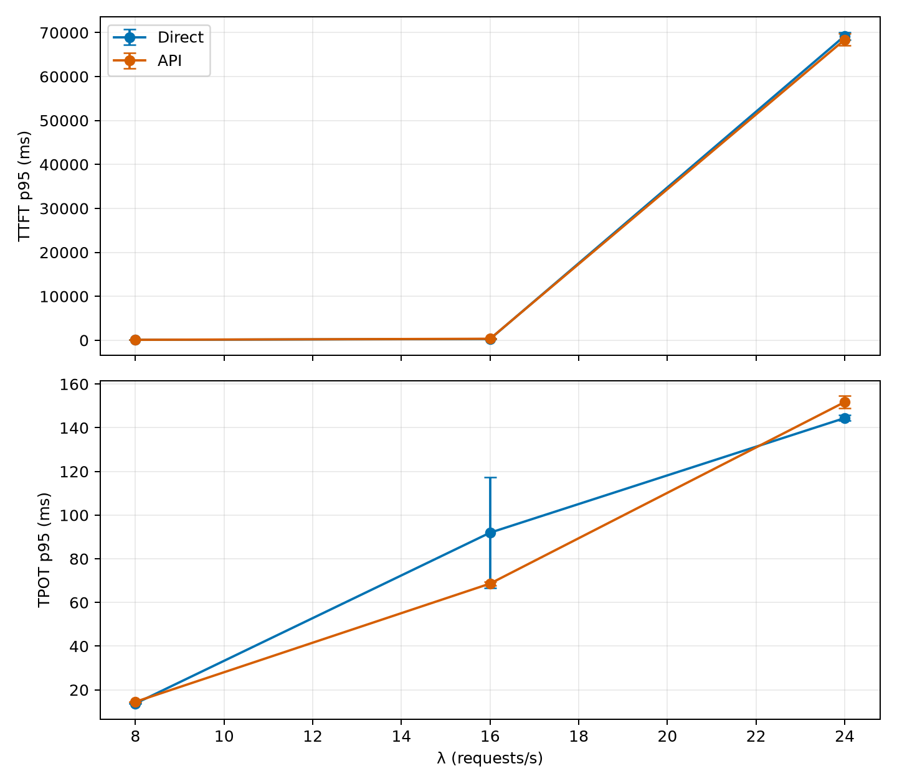

# Apertus-8B SwissAI API Overhead

**Date:** 2026-06-18  
**Model:** `swiss-ai/Apertus-8B-Instruct-2509`  
**Engine:** SGLang, radix cache disabled, metrics enabled  
**Served job:** `2561679` on `nid007232`  
**Replicates:** N=2 per endpoint path

## Research Question

Does routing requests through `https://api.swissai.svc.cscs.ch` add measurable latency or throughput overhead compared with hitting the same Apertus-8B SGLang server directly from the benchmarker allocation?

## Methodology

| Attribute | Value |
|---|---|
| Direct endpoint | `http://172.28.40.248:8080` |
| API endpoint | `https://api.swissai.svc.cscs.ch` |
| Served model name | `swiss-ai/Apertus-8B-Instruct-2509-api-overhead-sglang-brachium-20260618-183436` |
| Launch script | `launch-scripts/01_sglang_apertus8b_api_overhead.sh` |
| Prompt scenario | `thesis-apertus-medium` |
| Arrival process | Poisson |
| Sweep | `[8, 16, 24, 32, 40, 48, 56, 64]` with early stop |
| Phases | 60 s warmup, 180 s measurement, 300 s drain |
| SLOs used | TTFT p95 ≤ 10,000 ms, TPOT p95 ≤ 200 ms, error ≤ 1% |

Only the endpoint path changed between paired runs. The same served model, prompt shape, benchmark node class, and rate schedule were used for direct and API runs.

## Results

### TTFT p95 (ms, mean ± std)

| Path | λ=8 | λ=16 | λ=24 |
|---|---:|---:|---:|
| Direct | 87.9 ± 1.2 | 284.6 ± 74.3 | 69244.2 ± 843.6 |
| API | 98.0 ± 0.2 | 332.1 ± 20.6 | 68392.9 ± 1350.5 |

### TPOT p95 (ms, mean ± std)

| Path | λ=8 | λ=16 | λ=24 |
|---|---:|---:|---:|
| Direct | 13.7 ± 0.0 | 92.0 ± 25.3 | 144.4 ± 1.3 |
| API | 14.5 ± 0.1 | 68.6 ± 0.8 | 151.8 ± 2.8 |

### Output tokens/s (mean ± std)

| Path | λ=8 | λ=16 | λ=24 |
|---|---:|---:|---:|
| Direct | 2835.5 ± 3.7 | 5881.5 ± 3.1 | 8609.3 ± 4.4 |
| API | 2772.6 ± 0.9 | 5748.1 ± 7.6 | 8431.8 ± 8.4 |

### Error rate % (mean ± std)

| Path | λ=8 | λ=16 | λ=24 |
|---|---:|---:|---:|
| Direct | 0.0 ± 0.0 | 0.0 ± 0.0 | 0.0 ± 0.0 |
| API | 0.0 ± 0.0 | 0.0 ± 0.0 | 0.0 ± 0.0 |

Both paths passed through λ=16 and early-stopped at λ=24 due TTFT p95 saturation. The API path shows a small low-load TTFT increase, while TPOT and the saturation point are similar in these two replicates.

## DCGM Telemetry

### GPU utilization % (mean ± std)

| Path | λ=8 | λ=16 | λ=24 |
|---|---:|---:|---:|
| Direct | 25.0 ± 0.0 | 23.7 ± 1.3 | 24.9 ± 0.1 |
| API | 25.0 ± 0.0 | 25.0 ± 0.0 | 25.0 ± 0.0 |

### SM active % (mean ± std)

| Path | λ=8 | λ=16 | λ=24 |
|---|---:|---:|---:|
| Direct | 16.5 ± 0.5 | 21.1 ± 0.7 | 22.8 ± 0.2 |
| API | 16.6 ± 0.2 | 21.7 ± 0.0 | 23.0 ± 0.2 |

### Total GPU power W (mean ± std)

| Path | λ=8 | λ=16 | λ=24 |
|---|---:|---:|---:|
| Direct | 768.2 ± 0.6 | 787.4 ± 5.9 | 797.5 ± 0.7 |
| API | 777.8 ± 1.2 | 793.0 ± 1.6 | 796.5 ± 0.9 |

DCGM telemetry is queried with `slurm_job_id="2561679"` and aligned to each benchmark measurement window using timestamps from the run DBs.

## Provenance

| Path | Replicate | Benchmark job | DB |
|---|---:|---:|---|
| Direct | 1 | 2561761 | `data/direct_run1.db` |
| Direct | 2 | 2562891 | `data/direct_run2.db` |
| API | 1 | 2561998 | `data/api_run1.db` |
| API | 2 | 2563417 | `data/api_run2.db` |

## Limitations

- This is a serving-path overhead experiment, not a model quality evaluation.
- The workload uses the existing synthetic `thesis-apertus-medium` prompt shape.
- λ=24 is saturated in both paths, so API overhead should be interpreted mainly at λ=8 and λ=16.
- Client event-loop lag warnings appeared at λ=24, which reinforces treating the saturated point as overload evidence rather than a precise latency estimate.

Generated: 2026-06-18T18:43:04.693020+00:00
