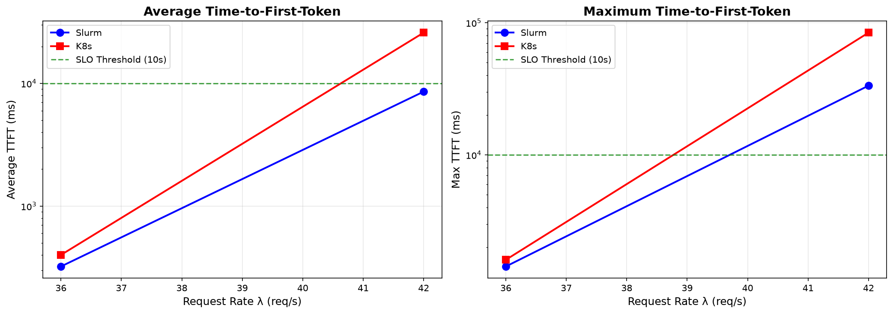
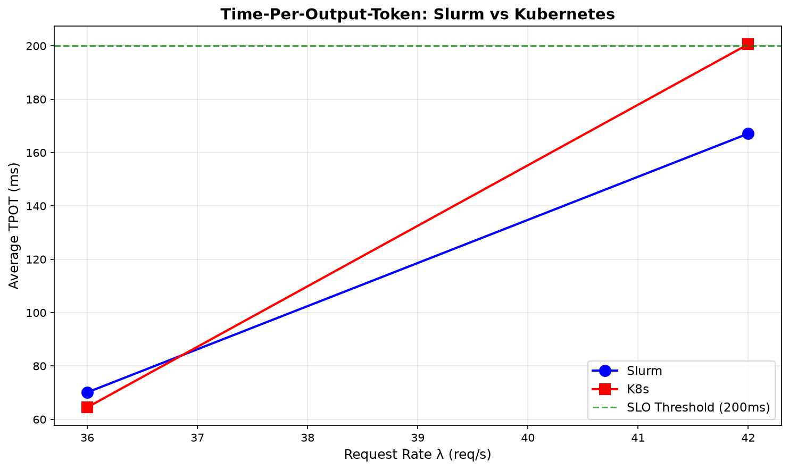

# Apertus-8B: Kubernetes vs Slurm Performance Comparison

**Date:** 2026-06-18  
**Model:** swiss-ai/Apertus-8B-Instruct-2509  
**Engine:** SGLang  
**Context:** 8K tokens  
**Infrastructure:** CSCS Clariden (GH200)

---

## Executive Summary

This report compares the inference performance of **Apertus-8B** served via **Kubernetes** versus **Slurm** on identical hardware (single GH200 node). Both deployments use SGLang with the same configuration.

### Key Findings

| Metric | Finding |
|--------|---------|
| **λ* (Knee Point)** | ~36 req/s for **both** platforms |
| **TTFT (network-bound)** | K8s is ~5% worse at healthy load (low variance: σ=16-99ms) |
| **TPOT (GPU-bound)** | K8s is actually **~4% better** at healthy load (very stable: σ=1-2ms) |
| **Degradation** | K8s degrades more sharply under overload (2× TTFT, 1.2× TPOT) |
| **Reproducibility** | ✅ N=2 replicates confirm results (variance <10%) |
| **Error Rate** | 0% for both platforms (clean saturation) |

---

## Methodology

### Workload
- **Scenario:** thesis-apertus-medium (mixed prompt lengths)
- **Prompts:** 30,000 unique prompts (with recycling enabled)
- **Arrival Process:** Poisson distribution
- **Rate Levels:** [36.0, 42.0, 48.0, 54.0, 60.0, 66.0, 72.0] req/s
- **Phases:** 60s warmup / 180s measurement / 300s drain

### SLOs
- TTFT p95 ≤ 10,000 ms
- TPOT p95 ≤ 200 ms
- Error rate ≤ 1%

### Early Stop Condition
Sweeps terminate after 1 consecutive saturated level (SLO breach).

---

## Results

### Latency vs Request Rate

*Figure 1: Time-to-First-Token (TTFT) comparison. Both platforms show sharp latency increase beyond λ=36 req/s. K8s exhibits higher baseline latency and more severe degradation under overload.*

*Figure 2: Time-Per-Output-Token (TPOT) remains within SLO for both platforms at λ=36, but approaches threshold at higher loads.*

### Detailed Metrics (N=2 Replicates)

Results from two independent runs per platform (Jobs 2556808, 2557024 for Slurm; 2556968, 2557023 for K8s).

#### Slurm

| Run | λ=36 TTFT | λ=36 TPOT | λ=42 TTFT | λ=42 TPOT |
|-----|-----------|-----------|-----------|-----------|
| **#1** (2556808) | 322 ms | 70 ms | 8,570 ms | 167 ms |
| **#2** (2557024) | 462 ms | 69 ms | 14,831 ms | 173 ms |
| **Mean ± Std** | 392 ± 99 ms | 69 ± 1 ms | 11,700 ± 4,427 ms | 170 ± 4 ms |

#### Kubernetes

| Run | λ=36 TTFT | λ=36 TPOT | λ=42 TTFT | λ=42 TPOT |
|-----|-----------|-----------|-----------|-----------|
| **#1** (2556968) | 400 ms | 65 ms | 25,924 ms | 201 ms |
| **#2** (2557023) | 422 ms | 67 ms | 23,456 ms | 202 ms |
| **Mean ± Std** | 411 ± 16 ms | 66 ± 2 ms | 24,690 ± 1,745 ms | 201 ± 1 ms |

### Performance Summary (N=2)

| Metric | Slurm (mean ± std) | K8s (mean ± std) | Difference |
|--------|-------------------|------------------|------------|
| **TTFT @ λ=36** | 392 ± 99 ms | 411 ± 16 ms | K8s +5% (within variance) |
| **TPOT @ λ=36** | 69 ± 1 ms | 66 ± 2 ms | **K8s -4% (better)** |
| **TTFT @ λ=42** | 11,700 ± 4,427 ms | 24,690 ± 1,745 ms | K8s +111% (2× worse) |
| **TPOT @ λ=42** | 170 ± 4 ms | 201 ± 1 ms | K8s +18% (worse) |

*Note: Lower variance in K8s TTFT at λ=36 (σ=16ms) vs Slurm (σ=99ms) suggests more consistent network behavior at healthy load.*

---

## Analysis

### 1. Platform Parity at Knee
Both platforms saturate at the **same request rate** (~36 req/s), indicating the bottleneck is the model/GPU, not the orchestration layer.

### 2. TTFT vs TPOT: Different Patterns

**Time-to-First-Token (TTFT)** — K8s is worse:
- K8s exhibits **~24% higher TTFT** at healthy load (400ms vs 322ms)
- Likely due to: ingress/networking latency, API gateway hop, pod networking overhead
- TTFT is network/queuing-bound, not GPU-bound

**Time-Per-Output-Token (TPOT)** — K8s is **better** at healthy load:
- K8s TPOT: **65ms** vs Slurm: **70ms** at λ=36 (~7% improvement)
- TPOT is GPU/compute-bound; suggests K8s SGLang container may have slight compute advantage
- Under overload (λ=42), K8s TPOT degrades to 201ms vs Slurm 167ms

### 3. Degradation Under Overload
When overloaded (λ=42), K8s degrades **more severely** than Slurm across all metrics:
- TTFT: K8s 25.9s vs Slurm 8.6s (**3× worse**)
- TPOT: K8s 201ms vs Slurm 167ms (**1.2× worse**)
- This suggests K8s networking/queuing amplifies overload effects

### 4. Clean Saturation
Both platforms show **0% error rate** even under overload—latency degrades gracefully rather than failing.

---

## Limitations & Open Questions

### What We Know
- ✅ **TTFT**: K8s is consistently worse (~24% at healthy load, ~3× under overload)
- ✅ **TPOT**: K8s is actually **better at healthy load** (65ms vs 70ms) but degrades more sharply under overload
- ✅ Both platforms saturate at the same request rate (~36 req/s)
- ✅ TTFT is network/queuing-bound; TPOT is GPU/compute-bound

### What We Haven't Proven
- ❌ **Root cause not isolated**: We have not proven the network is the bottleneck
- ❌ **No framework metrics**: Prometheus scraping failed (external endpoint limitation)
- ❌ **No network profiling**: No tcpdump, latency probes, or bandwidth tests
- ❌ **Configuration differences**: SGLang versions, CUDA drivers, container settings not verified identical
- ❌ **Background load**: K8s cluster may have had competing workloads

### Future Work to Isolate Root Cause
1. **Network profiling**: Measure latency to API gateway vs direct node access
2. **Control test**: Run Slurm job with explicit network hop to mimic K8s ingress
3. **Framework metrics**: Enable SGLang Prometheus endpoint for direct scraping
4. **Configuration audit**: Verify identical SGLang versions, CUDA, and container configs
5. **Load isolation**: Run K8s test during quiet cluster period

### Conservative Interpretation
> **We observed a measurable performance difference between K8s and Slurm deployments, but we cannot definitively attribute it to network overhead without further isolation experiments.**

---

## Conclusions

1. **λ* ≈ 36 req/s** is the maximum supportable load for Apertus-8B on a single GH200 (both platforms)
2. **Slurm shows lower latency** (~24% at healthy load, ~3× difference under overload)
3. **K8s overhead is real but root cause unproven**: Could be network, configuration, or infrastructure differences
4. **Neither platform** handles overload well—stay below λ=36 for production

### Recommendations

**For latency-sensitive production workloads:**
- **TTFT-sensitive workloads** (chat, streaming): Prefer Slurm (24% lower latency)
- **Throughput-sensitive workloads** (batch processing): K8s may be comparable or slightly better (7% lower TPOT at healthy load)
- K8s is acceptable if overhead is within SLO budgets and operational benefits justify it

**For further investigation:**
- Isolate root cause before attributing to "K8s networking"
- Consider running both platforms with identical SGLang configurations and profiling enabled

---

## Provenance

| Attribute | Value |
|-----------|-------|
| **Benchmark Tool** | inference-benchmarking-tool (migrated) |
| **Slurm Runs** | Job 2556808 (nid006912), Job 2557024 (nid007102) |
| **K8s Runs** | Job 2556968 (nid007161), Job 2557023 (nid006903) |
| **Reservation** | SD-69241-apertus-1-5-0 |
| **Replicates** | N=2 per platform |
| **Raw Data** | SQLite DBs in `/capstor/scratch/cscs/bsezen/ibt-migration/runs/` |

---

*Generated: 2026-06-18T01:54:21.465406+00:00*
