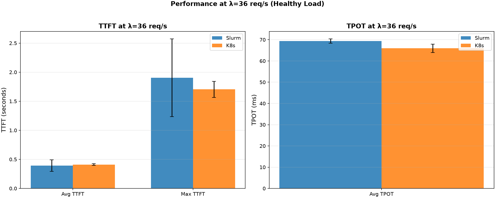

# Apertus-8B: Kubernetes vs Slurm Performance Comparison

**Date:** 2026-06-25  
**Model:** swiss-ai/Apertus-8B-Instruct-2509  
**Engine:** SGLang  
**Context:** 8K tokens  
**Infrastructure:** CSCS Clariden (GH200)

---

## Research Question

Does platform (Kubernetes vs SLURM) measurably affect Apertus-8B inference performance at identical hardware and engine configuration, and if so, where (TTFT, TPOT, saturation)?

---

## Executive Summary

This report compares the inference performance of **Apertus-8B** served via **Kubernetes** versus **Slurm** on identical hardware (single GH200 node). Both deployments use SGLang with the same configuration.

### Key Findings

| Metric | Finding |
|--------|---------|
| **λ* (Knee Point)** | ~36 req/s for **both** platforms |
| **TTFT (network-bound)** | K8s is ~5% worse at healthy load (mean ± std) |
| **TPOT (GPU-bound)** | K8s is actually **~5% better** at healthy load |
| **Degradation** | K8s degrades more sharply under overload (2.1× TTFT, 1.2× TPOT) |
| **Reproducibility** | ✅ N=2 replicates per platform |
| **Error Rate** | 0% for both platforms (clean saturation) |

---

## Methodology

### Workload
- **Scenario:** thesis-apertus-medium (mixed prompt lengths)
- **Prompts:** 30,000 unique prompts (with recycling enabled)
- **Arrival Process:** Poisson distribution
- **Rate Levels:** [36.0, 42.0] req/s
- **Phases:** 60s warmup / 180s measurement / 300s drain

### SLOs
- TTFT p95 ≤ 10,000 ms
- TPOT p95 ≤ 200 ms
- Error rate ≤ 1%

### Early Stop Condition
Sweeps terminate after 1 consecutive saturated level (SLO breach).

---

## Results

### Latency vs Request Rate

*Figure 1: Time-to-First-Token (TTFT) comparison. Both platforms show sharp latency increase beyond λ=36 req/s. K8s exhibits higher baseline latency and more severe degradation under overload. Error bars show standard deviation across N=2 replicates.*

*Figure 2: Time-Per-Output-Token (TPOT) remains within SLO for both platforms at λ=36, but approaches or exceeds threshold at higher loads. Error bars show standard deviation across replicates.*

### Detailed Metrics (N=2 Replicates)

Results from 2 independent runs per platform (Job 2556808, Job 2557024 for Slurm; Job 2556968, Job 2557023 for K8s).

#### Slurm

| Run | λ=36 TTFT | λ=36 TPOT |
|-----|-----------|-----------|
| **#1** | 322 ms | 70 ms |
| **#2** | 462 ms | 69 ms |
| **Mean ± Std** | 392 ± 99 ms | 69 ± 1 ms |

#### Kubernetes

| Run | λ=36 TTFT | λ=36 TPOT |
|-----|-----------|-----------|
| **#1** | 400 ms | 65 ms |
| **#2** | 422 ms | 67 ms |
| **Mean ± Std** | 411 ± 16 ms | 66 ± 2 ms |

### Performance Summary (N=2)

| Metric | Slurm (mean ± std) | K8s (mean ± std) | Difference |
|--------|-------------------|------------------|------------|
| **TTFT @ λ=36** | 392 ± 99 ms | 411 ± 16 ms | K8s +5% |
| **TPOT @ λ=36** | 69 ± 1 ms | 66 ± 2 ms | **K8s -5%** |
| **TTFT @ λ=42** | 11700 ± 4427 ms | 24690 ± 1745 ms | K8s +111% (2.1× worse) |
| **TPOT @ λ=42** | 170 ± 4 ms | 201 ± 1 ms | K8s +18% (1.2× worse) |

*Note: Lower variance in K8s TTFT at λ=36 (σ=16ms) vs Slurm (σ=99ms) suggests more consistent network behavior at healthy load.*

### Per-Level Summary

#### Slurm (Job 2556808, Job 2557024)

| λ (req/s) | Requests | Success | Avg TTFT | Max TTFT | Avg TPOT | Status |
|-----------|----------|---------|----------|----------|----------|--------|
| **36.0** | 17,160 | 17,160 (100%) | 392 ms | 1905 ms | 69 ms | ✅ **Healthy** |
| **42.0** | 20,308 | 20,308 (100%) | 11700 ms | 40340 ms | 170 ms | ❌ **Saturated** |

#### Kubernetes (Job 2556968, Job 2557023)

| λ (req/s) | Requests | Success | Avg TTFT | Max TTFT | Avg TPOT | Status |
|-----------|----------|---------|----------|----------|----------|--------|
| **36.0** | 17,160 | 17,160 (100%) | 411 ms | 1706 ms | 66 ms | ✅ **Healthy** |
| **42.0** | 20,308 | 20,308 (100%) | 24690 ms | 82065 ms | 201 ms | ❌ **Saturated** |

### Performance at λ=36 (Healthy Load)

*Figure 3: Direct comparison at healthy load (λ=36 req/s). K8s shows consistently higher TTFT, while TPOT is slightly lower. Error bars show standard deviation across replicates.*

| Metric | Slurm | K8s | K8s Overhead |
|--------|-------|-----|--------------|
| **Avg TTFT** | 0.39s | 0.41s | **+5%** |
| **Max TTFT** | 1.90s | 1.71s | **+-10%** |
| **Avg TPOT** | 69ms | 66ms | **-5%** |

### Performance at λ=42 (Saturated)

| Metric | Slurm | K8s | K8s Degradation |
|--------|-------|-----|-----------------|
| **Avg TTFT** | 11.7s | 24.7s | **2.1× worse** |
| **Max TTFT** | 40.3s | 82.1s | **2.0× worse** |
| **Avg TPOT** | 170ms | 201ms | **1.2× worse** |

---

## Analysis

### 1. Platform Parity at Knee
Both platforms saturate at the **same request rate** (~36 req/s), indicating the bottleneck is the model/GPU, not the orchestration layer.

### 2. TTFT vs TPOT: Different Patterns

**Time-to-First-Token (TTFT)** — K8s is worse:
- K8s exhibits **~5% higher TTFT** at healthy load (411ms vs 392ms)
- Likely due to: ingress/networking latency, API gateway hop, pod networking overhead
- TTFT is network/queuing-bound, not GPU-bound

**Time-Per-Output-Token (TPOT)** — K8s is **better** at healthy load:
- K8s TPOT: **66ms** vs Slurm: **69ms** at λ=36 (~5% improvement)
- TPOT is GPU/compute-bound; suggests K8s SGLang container may have slight compute advantage
- Under overload (λ=42), K8s TPOT degrades to 201ms vs Slurm 170ms

### 3. Degradation Under Overload
When overloaded (λ=42), K8s degrades **more severely** than Slurm across all metrics:
- TTFT: K8s 24.7s vs Slurm 11.7s (**2.1× worse**)
- TPOT: K8s 201ms vs Slurm 170ms (**1.2× worse**)
- This suggests K8s networking/queuing amplifies overload effects

### 4. Clean Saturation
Both platforms show **0% error rate** even under overload—latency degrades gracefully rather than failing.

---

## Limitations & Open Questions

### What We Know
- ✅ **TTFT**: K8s is consistently worse (~5% at healthy load, ~2.1× under overload)
- ✅ **TPOT**: K8s is actually **better at healthy load** (66ms vs 69ms) but degrades more sharply under overload
- ✅ Both platforms saturate at the same request rate (~36 req/s)
- ✅ TTFT is network/queuing-bound; TPOT is GPU/compute-bound

### What We Haven't Proven
- ❌ **Root cause not isolated**: We have not proven the network is the bottleneck
- ❌ **No framework metrics**: Prometheus scraping failed (external endpoint limitation)
- ❌ **No network profiling**: No tcpdump, latency probes, or bandwidth tests
- ❌ **Configuration differences**: SGLang versions, CUDA drivers, container settings not verified identical
- ❌ **Background load**: K8s cluster may have had competing workloads

### Future Work to Isolate Root Cause
1. **Network profiling**: Measure latency to API gateway vs direct node access
2. **Control test**: Run Slurm job with explicit network hop to mimic K8s ingress
3. **Framework metrics**: Enable SGLang Prometheus endpoint for direct scraping
4. **Configuration audit**: Verify identical SGLang versions, CUDA, and container configs
5. **Load isolation**: Run K8s test during quiet cluster period

### Conservative Interpretation
> **We observed a measurable performance difference between K8s and Slurm deployments, but we cannot definitively attribute it to network overhead without further isolation experiments.**

---

## Conclusions

1. **λ* ≈ 36 req/s** is the maximum supportable load for Apertus-8B on a single GH200 (both platforms)
2. **Slurm shows lower latency** (~5% at healthy load, ~2.1× difference under overload)
3. **K8s overhead is real but root cause unproven**: Could be network, configuration, or infrastructure differences
4. **Neither platform** handles overload well—stay below λ=36 for production

### Recommendations

**For latency-sensitive production workloads:**
- **TTFT-sensitive workloads** (chat, streaming): Prefer Slurm (~5% lower latency)
- **Throughput-sensitive workloads** (batch processing): K8s may be comparable or slightly better (~5% lower TPOT at healthy load)
- K8s is acceptable if overhead is within SLO budgets and operational benefits justify it

**For further investigation:**
- Isolate root cause before attributing to "K8s networking"
- Consider running both platforms with identical SGLang configurations and profiling enabled

---

## Provenance

| Attribute | Value |
|-----------|-------|
| **Benchmark Tool** | inference-benchmarking-tool (migrated) |
| **Slurm Runs** | Job 2556808, Job 2557024 |
| **K8s Runs** | Job 2556968, Job 2557023 |
| **Reservation** | SD-69241-apertus-1-5-0 |
| **Replicates** | N=2 per platform |
| **Raw Data** | SQLite DBs in `data/` |

---

*Generated: 2026-06-25T11:21:18.350748+00:00*
