# DeepSeek-V3 Latent vs Non-Latent MoE — TP16/EP16

**Date:** 2026-06-25
**Model family:** DeepSeek-V3-shaped MoE (random/tiled FP8 weights)
**Hardware:** Clariden, 4 GH200 nodes per variant, TP16/EP16
**Variants:**
- Non-latent baseline: N=64, k=4
- Latent via wider experts: N=64, k=4, `latent_moe_dim = 2048`, `moe_intermediate_size = 14,336`
- Latent via more experts: N=224, k=14, `latent_moe_dim = 2048`, `moe_intermediate_size = 4,096`
**Replicates:** N=2 per variant
**Benchmark nodes:** `infra01` with `SD-69241-apertus-1-5-0` reservation

## Research Question

Holding total parameters and active routed-expert parameters constant, does adding a latent projection around the MoE block improve or harm inference throughput and latency on TP16/EP16 GH200? And is any difference caused by the latent projection itself or by the shape used to keep parameter counts matched?

## Executive Summary

| Finding | Result |
|---|---|
| Maximum passing swept rate | Non-latent **λ=4 req/s**; both latent variants **λ=2 req/s** |
| Saturation point | Non-latent early-stops after λ=4; both latent variants early-stop after λ=2 |
| Binding gate at saturation | **TPOT p95** for all variants; TTFT stayed under 3,000 ms |
| Throughput at saturation | Non-latent ~1,400 output tok/s; latent variants ~740 output tok/s |
| Latency overhead of latent | ~40–75 % higher TPOT p95 at λ=1; ~55–95 % higher at λ=2 |
| Effect of latent shape | N=224/k=14 is slightly faster than N=64/k=14,336 at λ=2, but still breaches the 80 ms SLO |
| TTFT overhead of latent | ~2–3× higher than non-latent at matched λ |
| Error rate | 0% at every measured level for every variant |

The latent projection reduces the all-to-all hidden-state volume from 7,168 to 2,048, but both ways of keeping parameter counts matched — wider experts or more experts — end up roughly twice as slow as the non-latent baseline under the same TPOT SLO. The slowdown persists even with GPU-friendly expert shapes, pointing to the unfused down/up projections and/or untrained weights as the dominant cause.

## Methodology

| Attribute | Value |
|---|---|
| Scenario | `thesis-deepseek-medium` |
| Prompt source | `/capstor/scratch/cscs/bsezen/loadtest/prompts-deepseek-thesis.json`, label `medium` only |
| Source input-token shape | 1,000 medium prompts; min 401, median 589, p95 682, max 700 |
| Source output budget shape (`max_tokens`) | min 2, median 270, p95 541, max 869 |
| Total prompts | 20,000 generated from 1,000 medium prompts with recycling |
| Arrival process | Poisson |
| Sweep | `[1, 2, 3, 4, 6, 8, 10]` req/s with early stop after 1 saturated level |
| Phases | 60 s warmup, 180 s measurement, 300 s drain |
| SLOs | TTFT p95 ≤ 3,000 ms, TPOT p95 ≤ 80 ms, error ≤ 1% |
| Server context length | 4,096 tokens |

### Checkpoint shapes

All checkpoints target ~344 B total parameters and ~37.9 B active parameters per token.

| Property | Non-latent | Latent (wider) | Latent (more experts) | Notes |
|---|---|---|---|---|
| `hidden_size` | 7,168 | 7,168 | 7,168 | Same |
| `n_routed_experts` | 64 | 64 | 224 | More experts keeps expert width small |
| `num_experts_per_tok` | 4 | 4 | 14 | Higher k keeps active routed params matched |
| `moe_intermediate_size` | 4,096 | 14,336 | 4,096 | Wider vs more experts trade-off |
| `latent_moe_dim` | — | 2,048 | 2,048 | Hidden dim dispatched to experts |
| Total params | ~344 B | ~344 B | ~344 B | Matched |
| Active routed-expert params/token | ~20.4 B | ~20.4 B | ~20.4 B | Matched |
| Always-active projection params/token | — | ~1.7 B | ~1.7 B | Extra down/up projection cost |

The two latent variants isolate the shape question: the first keeps N/k fixed and widens experts; the second keeps expert width small and increases N/k proportionally. Both match the non-latent active routed-expert parameter budget.

### Serving Launch Configuration

| Variant | Served model | SLURM job | Nodes | Launch script |
|---|---|---:|---|---|
| Non-latent | `swiss-ai/dsv3-comparable-nonlatent-N64-k4-tp16-brachium-20260625-010705` | 2613594 | `nid[007019,007031,007047,007051]` | `scripts/01_sglang_nonlatent_n64_k4.sh` |
| Latent (wider) | `swiss-ai/dsv3-comparable-latent-N64-k4-tp16-brachium-20260625-023009` | 2614134 | `nid[006817,006821,006888-006889]` | `scripts/02_sglang_latent_n64_k4.sh` |
| Latent (more experts) | `swiss-ai/dsv3-comparable-latent-N224-k14-tp16-brachium-20260625-133537` | 2616868 | `nid[006809,006816,006818,006822]` | `scripts/03_sglang_latent_n224_k14.sh` |

All variants share: SGLang, `--disable-radix-cache`, `--enable-metrics`, `--tp-size 16`, `--ep-size 16`, `--mem-fraction-static 0.85`, FP8 serving, 4 nodes per replica. The latent variants use a patched SGLang container (`sglang_cuda13_latent_moe.sqsh`) that adds down/up projections around `DeepseekV2MoE`.

## Capacity

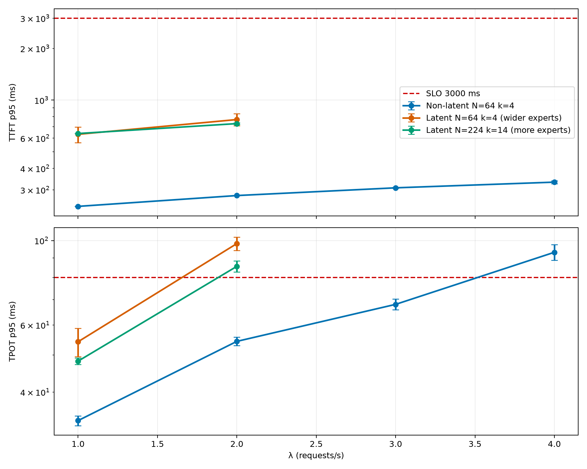

### TPOT p95 (ms) per rate level (rep1 / rep2)

| λ | Non-latent | Latent (wider) | Latent (more experts) |
|---:|---:|---:|---:|
| 1.0 | 32.7 / 34.7 | 49.6 / 58.9 | 49.2 / 47.3 |
| 2.0 | 53.0 / 55.7 | **102.1 / 94.2** | **88.4 / 82.7** |
| 3.0 | 70.2 / 65.8 | — | — |
| 4.0 | **97.6 / 88.7** | — | — |

Bold marks SLO breach (TPOT p95 ≤ 80 ms). λ=3/4 were not measured for latent variants because adaptive early-stop terminated after the λ=2 breach.

### TTFT p95 (ms) per rate level (rep1 / rep2)

| λ | Non-latent | Latent (wider) | Latent (more experts) |
|---:|---:|---:|---:|
| 1.0 | 239 / 241 | 566 / 698 | 639 / 638 |
| 2.0 | 279 / 277 | 833 / 707 | 738 / 720 |
| 3.0 | 311 / 306 | — | — |
| 4.0 | 339 / 326 | — | — |

TTFT stays well under the 3,000 ms gate for all variants, but both latent variants are 2–3× slower than non-latent.

## Token Throughput

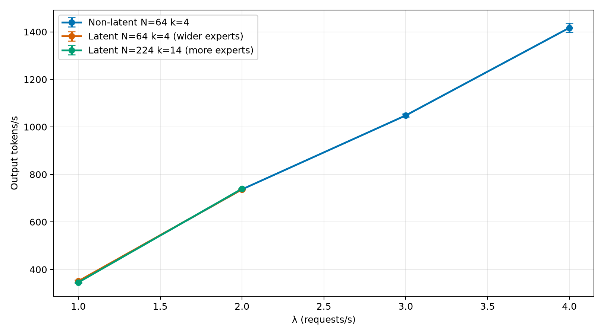

Output tokens/s scales roughly linearly with λ for all variants up to their respective knees. At λ=2 all three variants produce a similar absolute token rate (~735–740 tok/s), but both latent variants already breach the 80 ms TPOT p95 SLO, whereas non-latent remains compliant through λ=3 and only breaches at λ=4.

## DCGM Telemetry

Per-rate means across both replicates. `slurm_job_id` selector pinned per variant; metric windows aligned to each rate level's `server_stats` start/end.

| GPU util % | SM active % |
|---|---|
| 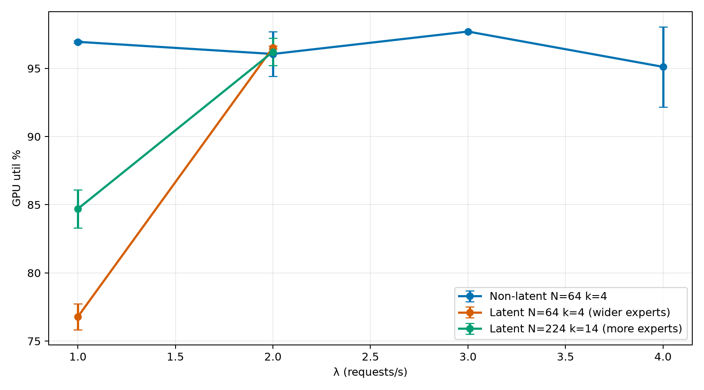 | 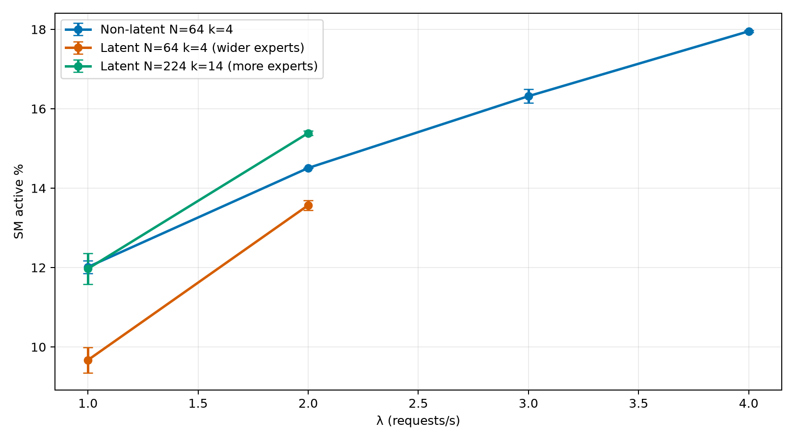 |

| Tensor active % | Mem copy util % |
|---|---|
| 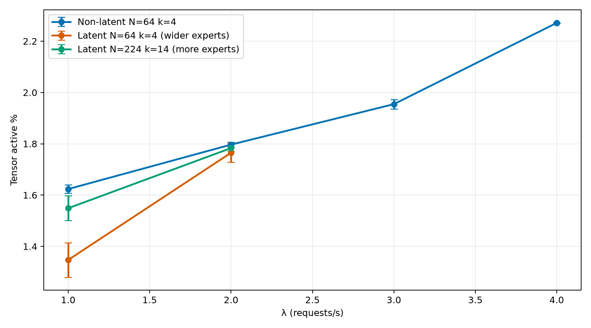 | 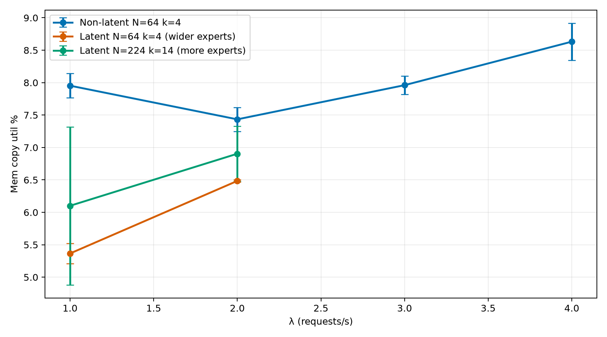 |

| Total GPU power | Framebuffer used |
|---|---|
| 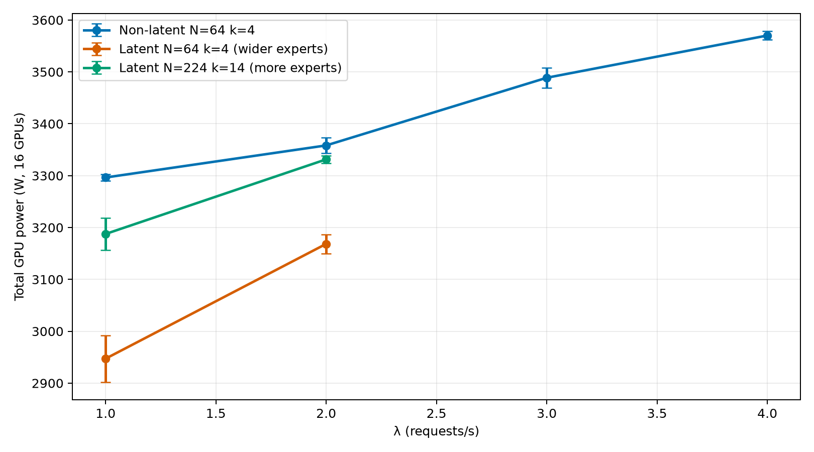 | 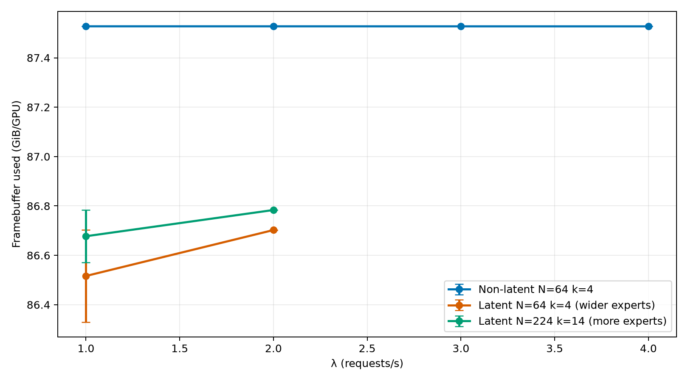 |

### GPU utilisation %

| λ | Non-latent | Latent (wider) | Latent (more experts) |
|---:|---:|---:|---:|
| 1.0 | 97.0 | 76.8 | 84.7 |
| 2.0 | 97.7 | 96.5 | 96.2 |
| 3.0 | 97.7 | — | — |
| 4.0 | 98.0 | — | — |

### SM active %

| λ | Non-latent | Latent (wider) | Latent (more experts) |
|---:|---:|---:|---:|
| 1.0 | 12.0 | 9.7 | 12.0 |
| 2.0 | 14.5 | 13.6 | 15.4 |
| 3.0 | 16.3 | — | — |
| 4.0 | 18.0 | — | — |

### Tensor-pipe active %

| λ | Non-latent | Latent (wider) | Latent (more experts) |
|---:|---:|---:|---:|
| 1.0 | 1.6 | 1.3 | 1.6 |
| 2.0 | 1.8 | 1.8 | 1.8 |
| 3.0 | 1.9 | — | — |
| 4.0 | 2.3 | — | — |

### Total GPU power, 16 GPUs, W

| λ | Non-latent | Latent (wider) | Latent (more experts) |
|---:|---:|---:|---:|
| 1.0 | 3,296 | 2,947 | 3,188 |
| 2.0 | 3,358 | 3,168 | 3,331 |
| 3.0 | 3,489 | — | — |
| 4.0 | 3,570 | — | — |

### Framebuffer used, GiB/GPU

| λ | Non-latent | Latent (wider) | Latent (more experts) |
|---:|---:|---:|---:|
| 1.0 | 87.5 | 86.3 | 86.7 |
| 2.0 | 87.5 | 86.7 | 86.8 |

`DCGM_FI_DEV_GPU_UTIL` is high for all variants, but at λ=1 the latent N=64/wider variant shows markedly lower GPU utilisation (~77 %) than the other two. The latent N=224/more-experts variant recovers to ~85 % at λ=1 and ~96 % at λ=2, with SM/tensor activity close to non-latent. This confirms that the skinny/wide GEMM shape in the N=64 latent variant hurts occupancy, but even the better-shaped N=224 variant does not close the latency gap with non-latent.

## Communication

Intra-node NVLink TX/RX bytes via `DCGM_FI_PROF_NVLINK_{TX,RX}_BYTES`, summed across all 16 GPUs and rate'd over each rate level's measurement window. Slingshot counters are from `slingshot_{tx,rx}_bytes_total` summed across all HSN interfaces and nodes. PCIe counters stay below ~1 MiB/s for both variants.

| NVLink TX | NVLink RX |
|---|---|
| 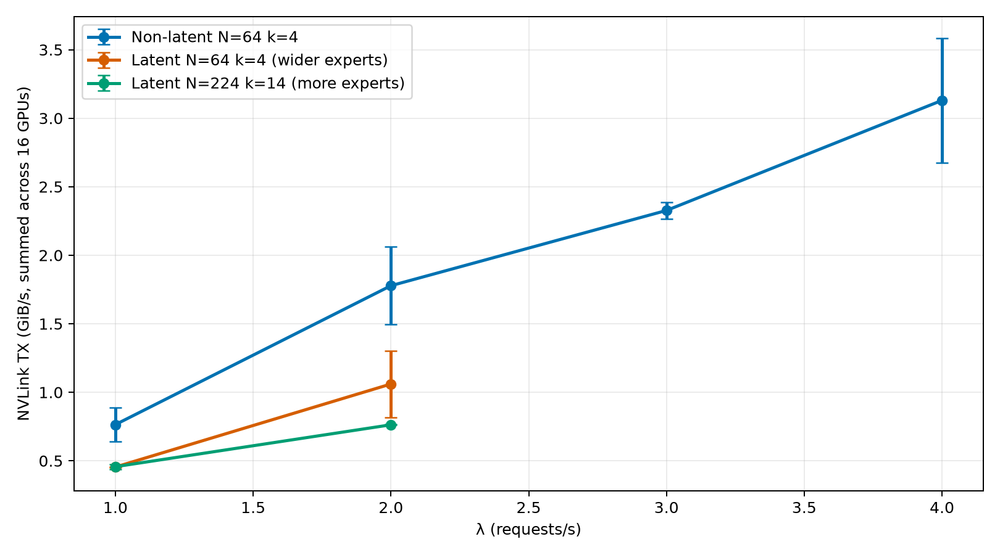 | 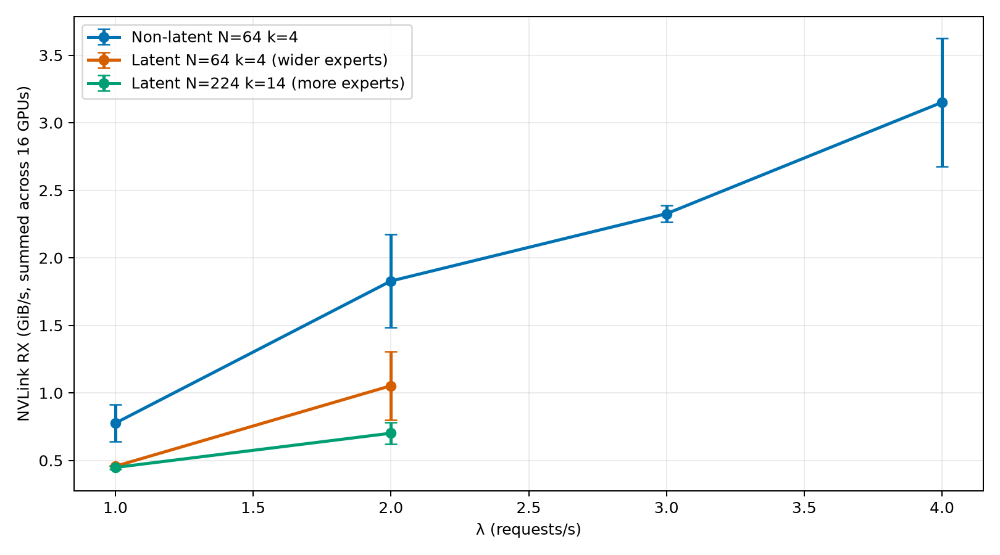 |

| PCIe TX | PCIe RX |
|---|---|
| 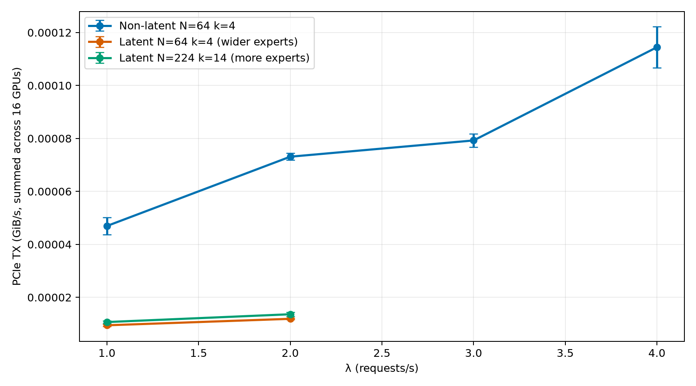 | 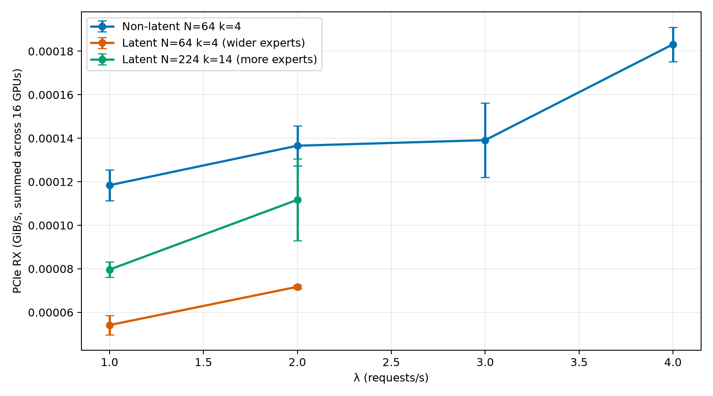 |

| Slingshot packets/s (TX / RX) | Slingshot bytes/s (diagnostic, log scale) |
|---|---|
| 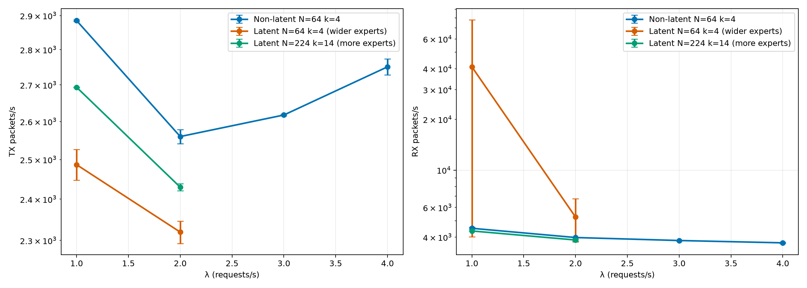 | 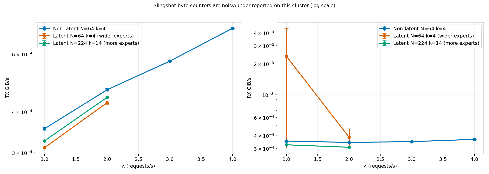 |

### NVLink TX, GiB/s aggregate (16 GPUs)

| λ | Non-latent | Latent (wider) | Latent (more experts) |
|---:|---:|---:|---:|
| 1.0 | 0.76 | 0.45 | 0.46 |
| 2.0 | 1.83 | 0.81 | 0.76 |
| 3.0 | 2.33 | — | — |
| 4.0 | 3.60 | — | — |

### Slingshot packet rates, aggregate (all HSN interfaces, 4 nodes)

| λ | Non-latent TX | Non-latent RX | Latent (wider) TX | Latent (wider) RX | Latent (more experts) TX | Latent (more experts) RX |
|---:|---:|---:|---:|---:|---:|---:|
| 1.0 | 2,883 | 4,456 | 2,487 | 40,983 | 2,693 | 4,353 |
| 2.0 | 2,554 | 3,882 | 2,320 | 5,263 | 2,430 | 3,847 |

The Slingshot byte counters are noisy and frequently round to zero with the current `rate()` window, so the primary Slingshot view now uses packet rates. Packet rates are far more stable (~2,300–78,000 pkt/s). The latent N=64/k=4 replicate 1 shows a large RX packet spike at λ=1 (~78,000 pkt/s) that is not reproduced in replicate 2 or in the N=224 variant; treating it as an outlier, the three variants sit in a similar packet-rate band. This suggests the Slingshot fabric is not the differentiating bottleneck.

NVLink traffic is lower for both latent variants, which is expected because the all-to-all hidden-state volume is reduced from 7,168 to 2,048. However, the reduction in communication does not translate into better throughput because the compute path is less efficient.

## Interpretation

- **Saturation throughput.** Non-latent supports roughly twice the request rate of either latent variant under the same TPOT p95 SLO (λ=4 vs λ=2). Changing the latent shape from wider experts to more experts does not move the knee.
- **Latency at low load.** Even at λ=1, both latent variants have ~40–75 % higher TPOT p95 than non-latent. The extra projection layers add per-token overhead that is visible before queueing effects appear.
- **Effect of shape.** At λ=2 the N=224/k=14 latent variant is slightly faster than the N=64/k=14,336 variant (TPOT p95 ~83–88 ms vs ~94–102 ms), and its λ=1 GPU utilisation is higher (~85 % vs ~77 %). This confirms that the skinny/wide GEMM shape hurts occupancy, but the improvement is not enough to recover the non-latent performance.
- **TTFT.** Both latent variants show 2–3× higher TTFT than non-latent, indicating the prefilling stage is slowed by the latent path.
- **GPU efficiency.** The N=224 variant has SM/tensor activity close to non-latent, yet it still saturates at λ=2. This suggests the remaining overhead is not GEMM occupancy but the unfused down/up projections (extra HBM round-trips per layer) and/or the untrained projection weights.
- **Communication.** The all-to-all volume reduction is real (lower NVLink), but it is not the bottleneck on this topology/workload. The compute/memory overhead of the latent path dominates.

**Answer to the research question.** Holding total and active routed-expert parameters constant, adding a `latent_moe_dim = 2048` projection around the MoE block **harms** inference throughput and latency on this SGLang serving stack, regardless of whether the parameter budget is preserved by widening experts or by adding more experts. Both latent variants saturate at half the request rate of the non-latent baseline.

## Why the latent variants are slower

The generator matched active routed-expert parameters for both latent shapes:

```
non-latent:            58 × 4 × 3 × 7168 × 4096  ≈ 20.4 B
latent (wider):        58 × 4 × 3 × 2048 × 14336 ≈ 20.4 B
latent (more experts): 58 × 14 × 3 × 2048 × 4096 ≈ 20.4 B
```

Both latent paths also add always-active down/up projections:

```
58 layers × 2 × 7168 × 2048 ≈ 1.7 B extra params/token (~8 %)
```

### Shape effect: wider experts vs more experts

| Variant | Expert gate/up | Expert down | Comment |
|---|---|---|---|
| Non-latent | `(B, 7168) × (7168, 4096)` | `(B, 4096) × (4096, 7168)` | Baseline |
| Latent (wider) | `(B, 2048) × (2048, 14336)` | `(B, 14336) × (14336, 2048)` | Contracting/output dim drops 3.5× |
| Latent (more experts) | `(B, 2048) × (2048, 4096)` | `(B, 4096) × (4096, 2048)` | Same dims as non-latent, just smaller |

The N=224/k=14 variant uses the same 2,048-dim latent space but keeps the expert intermediate size at 4,096, so its per-expert GEMMs are much more GPU-friendly than the N=64/k=14,336 variant. The DCGM data confirm this: N=224 reaches ~85 % GPU utilisation at λ=1 and ~96 % at λ=2, with SM/tensor activity close to non-latent. Yet it still saturates at λ=2.

### Remaining overhead

Because the N=224 variant has good GEMM occupancy but still loses to non-latent, the dominant inefficiency is likely:

1. **Unfused projections.** The custom SGLang patch adds separate down/up linear layers around the MoE block, writing the latent tensor to HBM and reading it back twice per layer.
2. **Untrained weights.** Random/tiled weights mean the latent projection is not learned to preserve task-relevant feature structure.

The 8 % extra parameters from the projections are a secondary effect.

## Context: latent MoE in the literature

This result should not be read as a general verdict on latent MoE. Several pieces of context limit its scope.

**DeepSeek-V3 does not use latent MoE.** The “latent” in DeepSeek-V3 refers to Multi-head Latent Attention (MLA), a KV-cache compression mechanism. The MoE block is standard DeepSeekMoE (`n_routed_experts=256`, `num_experts_per_tok=8`, `moe_intermediate_size=1,408`) with no down/up projection around the routed experts. This benchmark compares standard DeepSeekMoE-shaped blocks against *hypothetical* latent-MoE modifications, not against native DeepSeek-V3 design choices.

**Recent latent-MoE proposals report serving improvements, not regressions.** NVIDIA’s LatentMoE (arXiv:2601.18089, adopted in Nemotron-3 Super/Ultra) projects tokens to a smaller latent dimension before dispatch, keeps expert intermediate size and top-k unchanged, and projects up to 3.5× iso-accuracy speedup over standard MoE at trillion-parameter scale. MoLAE (arXiv:2503.23100) also reports comparable model quality with substantially reduced resource requirements. These works suggest that a well-designed latent-MoE layer should reduce, not increase, serving cost.

**Why this benchmark shows the opposite.** The discrepancy is explained by implementation choices in our controlled comparison:

1. **Unfused projections.** The custom SGLang patch adds separate down/up linear layers around the MoE block, writing the latent tensor to HBM and reading it back twice per layer. Production latent-MoE kernels fuse these projections into the dispatch/combine path.
2. **Untrained weights.** The checkpoints use random/tiled FP8 weights, so the latent projection is not learned to preserve task-relevant feature structure. A trained latent projection can use a much smaller latent dimension without quality loss.
3. **No shape rescue.** We tested two ways of matching parameter budgets (wider experts vs more experts). The more-experts shape improves GPU occupancy but still does not close the latency gap, confirming that shape alone is not the fix.

Taken together, our result is best interpreted as a **negative result for this specific patch and untrained-weight setup**: latent MoE is not automatically faster, and the serving benefit depends strongly on kernel fusion and training.

## Disclosures & Limitations

- Random/tiled FP8 weights — capacity figures only, not model quality. Quality evaluation was disabled.
- Single scenario (`medium`): input ≤700 tokens, output ≤869 tokens. Conclusions do not extend to long-input or long-output regimes.
- Adaptive early-stop terminates 1 level past first breach; latent variants were not characterised beyond λ=2.
- The latent SGLang support is a custom patch, not upstream. A fused kernel implementation could change the conclusion.
- Slingshot byte counters are under-reported/noisy; the Communication section should be interpreted cautiously.
- All variants used `--disable-radix-cache` so results reflect cold-scheduler behavior.
- The N=224/k=14 latent variant uses a much higher top-k (14) than typical DeepSeekMoE configurations; this itself adds dispatch overhead that partly offsets the shape benefit.

## Provenance

| Item | Value |
|---|---|
| Non-latent served model | `swiss-ai/dsv3-comparable-nonlatent-N64-k4-tp16-brachium-20260625-010705` |
| Latent (wider) served model | `swiss-ai/dsv3-comparable-latent-N64-k4-tp16-brachium-20260625-023009` |
| Latent (more experts) served model | `swiss-ai/dsv3-comparable-latent-N224-k14-tp16-brachium-20260625-133537` |
| Non-latent deployment SLURM job | 2613594 |
| Latent (wider) deployment SLURM job | 2614134 |
| Latent (more experts) deployment SLURM job | 2616868 |
| Non-latent benchmark SLURM jobs | 2613840 (rep1), 2614009 (rep2) |
| Latent (wider) benchmark SLURM jobs | 2614357 (rep1), 2614363 (rep2) |
| Latent (more experts) benchmark SLURM jobs | 2617155 (rep1), 2617375 (rep2) |
| Result DBs | `results/nonlatent_rep{1,2}.db`, `results/latent_rep{1,2}.db`, `results/n224-k14/latent_n224_k14_rep{1,2}.db` |
| Launch scripts | `scripts/01_sglang_nonlatent_n64_k4.sh`, `scripts/02_sglang_latent_n64_k4.sh`, `scripts/03_sglang_latent_n224_k14.sh` |
| Prompt generation | `scripts/generate_prompts.sh` |
| Checkpoint generation | `scripts/generate_checkpoints.sh` |
| Regenerate this report's data + plots | `uv run --with matplotlib python generate_report.py` |
| Machine-readable summary | `data.json` |
