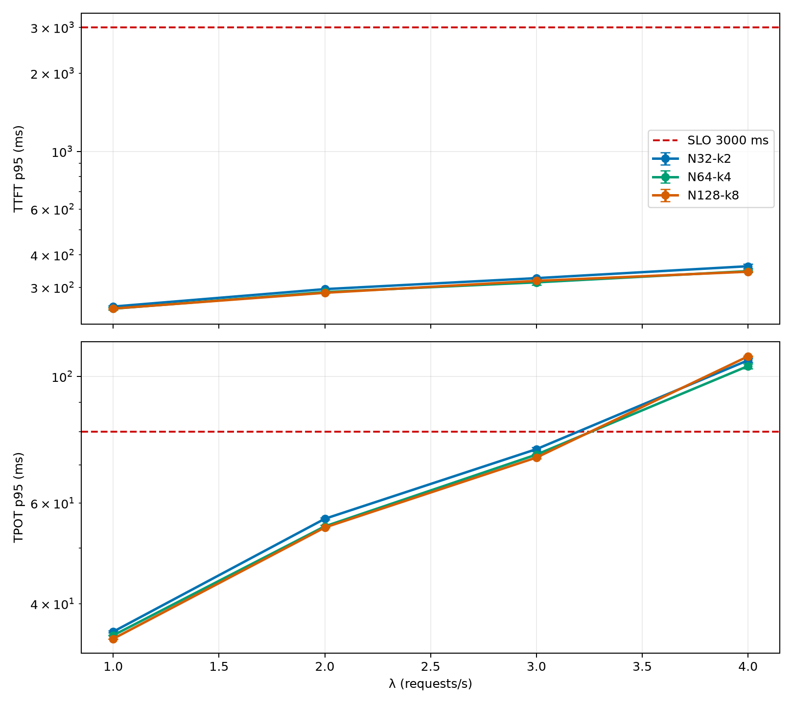
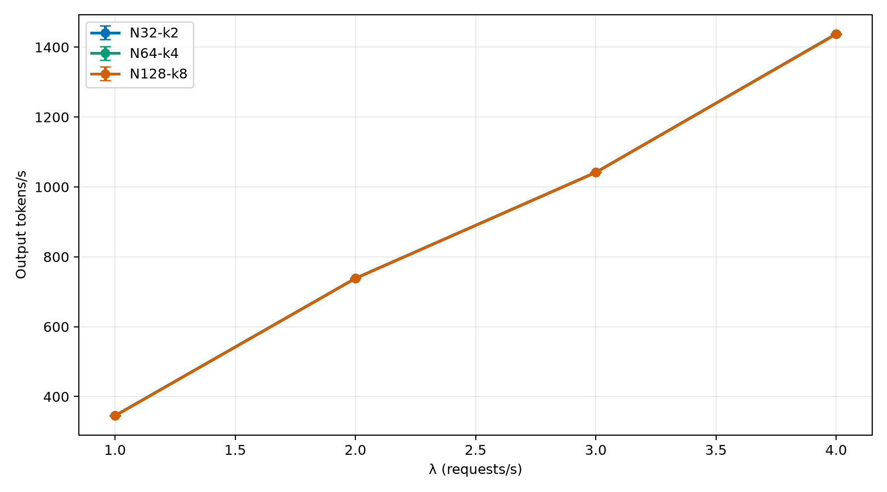

# DeepSeek-V3 Non-Latent MoE: expert-granularity sweep at constant compute

**Date:** 2026-06-18
**Model family:** DeepSeek-V3 non-latent MoE (random/tiled FP8 weights)
**Hardware:** Clariden, 4 GH200 nodes per variant, TP16/EP16
**Variants:** N=32/k=2, N=64/k=4, N=128/k=8 (all `k/N = 6.25%`, ~346B total / ~40B active per token)
**Replicates:** N=2 per variant
**Benchmark nodes:** `infra01` with `SD-69241-apertus-1-5-0` reservation

## Research Question

Holding total/active parameters and serving topology constant (TP16/EP16, k/N = 6.25%), does expert granularity (N=32/k=2 → 64/k=4 → 128/k=8) measurably affect throughput or latency?

## Executive Summary

This report sweeps a single MoE design knob — expert granularity — at fixed total/active parameters and fixed serving topology, asking whether the dispatch overhead of more experts shows up in supportable throughput or in latency. The three SGLang deployments use identical workload, arrival process, phases, SLOs, and prompt pool.

| Finding | Result |
|---|---|
| Maximum passing swept rate | All three variants pass through **λ=3 req/s** |
| Saturation point | All three early-stop at **λ=4 req/s** |
| Binding gate at saturation | **TPOT p95** for every variant; TTFT stayed well under the 3,000 ms gate |
| Variant-to-variant spread at the knee | ~3–5 ms TPOT p95 — within run-to-run noise |
| Replicability | The λ=4 failure mode reproduced across replicates and across variants |
| Error rate | 0% at every measured level for every variant and replicate |

## Methodology

| Attribute | Value |
|---|---|
| Scenario | `thesis-deepseek-medium` |
| Prompt source | `/capstor/scratch/cscs/bsezen/loadtest/prompts-deepseek-thesis.json`, label `medium` only |
| Source input-token shape | 1,000 medium prompts; min 401, median 589, p95 682, max 700 |
| Source output budget shape (`max_tokens`) | min 2, median 270, p95 541, max 869 |
| Worst-case window (input + output) | 1,412 tokens |
| Total prompts | 20,000 generated from 1,000 medium prompts with recycling |
| Arrival process | Poisson |
| Sweep | `[1, 2, 3, 4, 6, 8, 10]` req/s with early stop after 1 saturated level |
| Phases | 60 s warmup, 180 s measurement, 300 s drain |
| SLOs | TTFT p95 ≤ 3,000 ms, TPOT p95 ≤ 80 ms, error ≤ 1% |
| Server context length | 4,096 tokens (SGLang default) |

The corpus is intentionally synthetic: each prompt is filler `" token"` text shaped to hit exact target token counts. The sweep uses only the `medium` label; long-input, xl-input, and long-output labels were not exercised. This makes the workload suitable for controlled throughput/latency stress, but not for quality conclusions.

### Serving Launch Configuration

| Variant | Served model | SLURM job | Nodes | Launch script |
|---|---|---:|---|---|
| N=32 / k=2 | `swiss-ai/dsv3-nonlatent-N32-k2-tp16-brachium-20260618-145933` | 2560219 | `nid[006249,006273,006284,006291]` | `sml/model-launch/local/dsv3-nonlatent-moe-sweep/01_sglang_n32_k2.sh` |
| N=64 / k=4 | `swiss-ai/dsv3-nonlatent-N64-k4-tp16-brachium-20260618-164631` | 2561154 | `nid[006134,006139-006140,006284]` | `sml/model-launch/local/dsv3-nonlatent-moe-sweep/02_sglang_n64_k4.sh` |
| N=128 / k=8 | `swiss-ai/dsv3-nonlatent-N128-k8-tp16-brachium-20260618-174321` | 2561481 | `nid[006125,006152,006906,006928]` | `sml/model-launch/local/dsv3-nonlatent-moe-sweep/03_sglang_n128_k8.sh` |

All three variants share: SGLang, `--disable-radix-cache`, `--enable-metrics`, `--tp-size 16`, `--ep-size 16`, FP8 serving, 4 nodes per replica. Radix caching is disabled so the sweep measures cold scheduler behavior, not cache reuse.

## Capacity

### TPOT p95 (ms) per rate level (run1 / run2)

| λ | N=32 / k=2 | N=64 / k=4 | N=128 / k=8 |
|---:|---:|---:|---:|
| 1.0 | 35.7 / 35.6 | 35.1 / 34.9 | 34.7 / 34.6 |
| 2.0 | 56.1 / 56.6 | 54.3 / 54.9 | 54.3 / 54.4 |
| 3.0 | 75.2 / 74.0 | 73.1 / 72.9 | 71.8 / 72.4 |
| 4.0 | **107.6 / 105.8** | **105.4 / 103.3** | **108.6 / 108.2** |

Bold marks SLO breach (TPOT p95 ≤ 80 ms). λ=6/8/10 were not measured: adaptive early-stop terminates 1 level past first breach.

### TTFT p95 (ms) per rate level (run1 / run2)

| λ | N=32 / k=2 | N=64 / k=4 | N=128 / k=8 |
|---:|---:|---:|---:|
| 1.0 | 254 / 249 | 247 / 244 | 246 / 248 |
| 2.0 | 294 / 296 | 288 / 287 | 284 / 287 |
| 3.0 | 328 / 323 | 307 / 320 | 314 / 321 |
| 4.0 | 370 / 355 | 350 / 343 | 345 / 344 |

TTFT never approaches the 3,000 ms gate. Saturation is entirely a decode (TPOT) story for this workload + topology.

## Token Throughput

Output tokens/s scales roughly linearly with λ across all three variants up to the knee, with overlapping curves — consistent with the same supportable throughput across expert granularities.

## Interpretation

- **Saturation throughput.** Identical across N=32/64/128: all three variants pass at λ=3 and breach at λ=4 under the same SLOs. The supportable RPS is unchanged.
- **TPOT below the knee.** Indistinguishable (≤1 ms p95 spread) up to λ=3.
- **TPOT at the knee (λ=4).** N=128/k=8 is the slowest by ~3–5 ms p95 vs the two smaller-N variants, consistent with higher per-token expert-dispatch cost when k=8 active experts must be routed. The difference is too small to move the knee λ.
- **TTFT.** Identical within noise across variants; not the binding gate at any measured level.
- **Errors.** 0% at every measured level across every variant and replicate.

**Answer to the research question.** Holding total/active compute and serving topology constant with `k/N = 6.25%`, varying expert granularity from N=32/k=2 to N=128/k=8 does not measurably change supportable throughput on TP16/EP16 GH200 with this workload. There is a small but real per-token dispatch cost at higher k (~3–5 ms TPOT at the knee), but it does not shift the knee λ.

## Disclosures & Limitations

- Random/tiled FP8 weights — capacity figures only, not model quality. Quality evaluation was disabled.
- Single scenario (`medium`): input ≤700 tokens, output ≤869 tokens. Conclusions do not extend to long-input, xl-input, or long-output regimes.
- Adaptive early-stop terminates 1 level past first breach; supportable throughput beyond λ=4 was not characterised for any variant.
- `N=256, k=16` excluded — comparable ~346B size requires `moe_intermediate_size=1024`, which does not satisfy strict TP16 FP8 alignment (`% (128 * TP) == 0`). See `NOTES.md`.
- All three variants were replicated N=2. The N=32/k=2 run 1 hit a benign primer-warmup `http_400` because the IBT `max_model_len` (8,192) exceeded the SGLang default context length (4,096); this affected only the synthetic warmup request, not measured traffic (medium prompts max 1,412 input+output tokens, well within 4,096). Run 2 was executed after aligning `max_model_len=4,096` in the IBT config and reproduced the knee within ~2 ms TPOT p95.
- DCGM `hardware_stats` rows are empty for these runs — no GPU-utilisation/power telemetry is included alongside the latency data.
- One N=64/k=4 attempt (`2561168`) failed because the API gateway listed the model in `/v1/models` before the upstream provider was actually serving. The benchmark hit `http_503` on every request and was discarded. The workflow now requires an actual `/v1/chat/completions` probe before submission (see `BENCHMARK_WORKFLOW.md`).

## Provenance

| Item | Value |
|---|---|
| N=32/k=2 served model | `swiss-ai/dsv3-nonlatent-N32-k2-tp16-brachium-20260618-145933` |
| N=64/k=4 served model | `swiss-ai/dsv3-nonlatent-N64-k4-tp16-brachium-20260618-164631` |
| N=128/k=8 served model | `swiss-ai/dsv3-nonlatent-N128-k8-tp16-brachium-20260618-174321` |
| N=32/k=2 run DBs | `experiments/dsv3-nonlatent-moe-sweep/n32-k2/sglang_run1.db`, `sglang_run2.db` |
| N=64/k=4 run DBs | `experiments/dsv3-nonlatent-moe-sweep/n64-k4/sglang_run1.db`, `sglang_run2.db` |
| N=128/k=8 run DBs | `experiments/dsv3-nonlatent-moe-sweep/n128-k8/sglang_run1.db`, `sglang_run2.db` |
| Per-variant run notes | `experiments/dsv3-nonlatent-moe-sweep/{n32-k2,n64-k4,n128-k8}/notes.md` |
| Sweep plan and model-generation commands | `NOTES.md` (this folder) |
| Regenerate this report's data + plots | `uv run --with matplotlib python generate_report.py` |
| Machine-readable summary | `data.json` |
